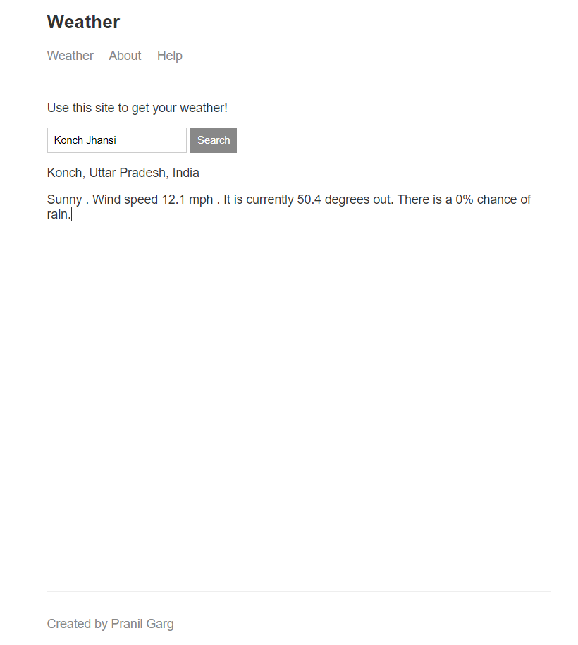

A Web application that displays the weather conditions of any geographic location over the globe. 
Developed using Node JS , deployed on Heroku , Hosted on the server using ExpressjS. 
Mapbox API used to fetch geo-coordinates of the location entered by User. 
Weather API used to fetch weather conditions of that location on passing the coordinates obtained.

